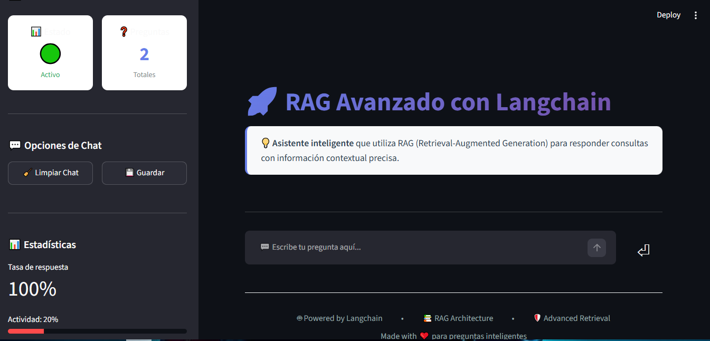
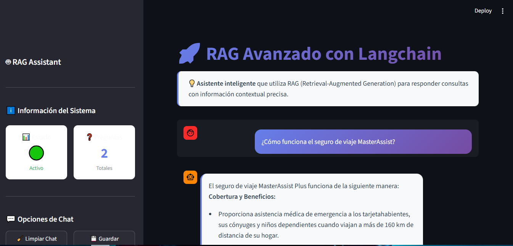
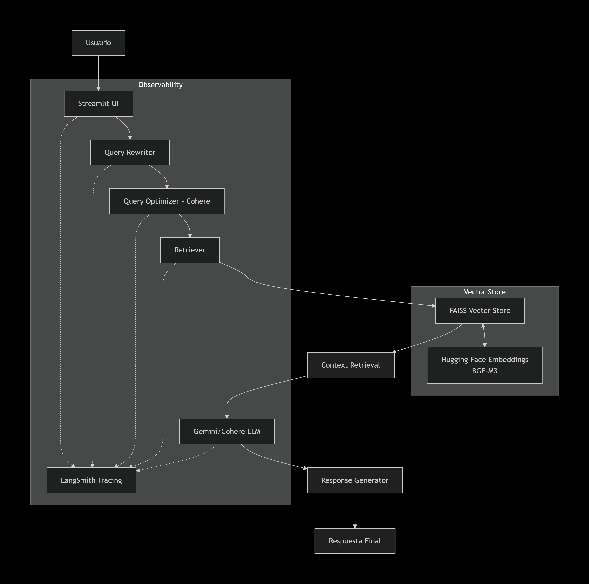

# Advanced RAG Assistant


Sistema RAG (Retrieval-Augmented Generation) avanzado construido con LangChain, Gemini, Hugging Face Embeddings, FAISS y Cohere como LLM principal para consultas optimizadas. Este sistema proporciona respuestas precisas y contextualizadas mediante la combinación de búsqueda semántica y generación de lenguaje natural.

## 🚀 Características

- **Semantic Search con FAISS**: Búsqueda vectorial eficiente para recuperar documentos relevantes
- **Query Rewriting**: Mejora de consultas para optimizar los resultados de búsqueda
- **Hugging Face Embeddings (BGE-M3)**: Embeddings de alta calidad para representación semántica
- **Google Gemini**: Modelo LLM para generación de respuestas
- **Cohere Integration**: LLM adicional para consultas optimizadas y mejor rendimiento
- **Streamlit UI**: Interfaz de usuario intuitiva y responsiva
- **Persistencia de Vector Store**: Guardado y carga de índices FAISS para reutilización
- **LangSmith Observability**: Monitoreo y trazabilidad de ejecuciones

## 📁 Estructura del Proyecto
```text
advanced-rag-assistant/
├── app/
│   ├── chains/
│   │   ├── __init__.py
│   │   ├── query_rewriter.py
│   │   └── rag_chain.py
│   ├── config/
│   │   ├── __init__.py
│   │   └── settings.py
│   ├── loaders/
│   │   ├── __init__.py
│   │   └── pdf_loader.py
│   ├── models/
│   │   ├── __init__.py
│   │   ├── cohere_model.py
│   │   └── gemini.py
│   ├── processing/
│   │   ├── __init__.py
│   │   ├── chunking.py
│   │   └── embeddings.py
│   ├── prompts/
│   │   ├── __init__.py
│   │   ├── rag_prompt.py
│   │   └── rewriter_prompt.py
│   ├── retrievers/
│   │   ├── __init__.py
│   │   └── retriever.py
│   ├── services/
│   │   ├── __init__.py
│   │   ├── rag_service.py
│   │   └── vectorstore_service.py
│   ├── utils/
│   │   └── __init__.py
│   └── vectorstores/
│       ├── __init__.py
│       └── faiss_store.py
├── assets/
│   ├── arquitectura.png
│   ├── chat.png
│   └── principal.png
├── data/
│   └── documentos/
│       ├── mc_beneficios.pdf
│       ├── mc_beneficios_global.txt
│       └── seguros_mc_platinum.pdf
└── vector_db/
|    └── faiss_index/
|       ├── index.faiss
|       └── index.pkl
├── LICENSE
├── main.py
├── README.md
├── requirements.txt
├── streamlit_app.py
```

## 🛠️ Tecnologías

- **Python 3.13**: Lenguaje de programación
- **LangChain**: Framework para aplicaciones LLM
- **Google Gemini**: LLM para generación de respuestas
- **Cohere**: LLM para consultas optimizadas y mejor rendimiento
- **Hugging Face**: Embeddings BGE-M3
- **FAISS**: Vector store para búsqueda semántica
- **Streamlit**: UI para aplicación web
- **LangSmith**: Observabilidad y monitoreo

## 📦 Instalación

### Clonar repositorio

```bash
git clone https://github.com/tu_usuario/advanced-rag-assistant.git
```

### Crear entorno virtual

```bash
python -m venv .venv
```

### Activar entorno

Windows:

```bash
.venv\Scripts\activate
```

Linux:

```bash
source .venv/bin/activate
```

### Instalar dependencias

```bash
pip install -r requirements.txt
```

Edita el archivo .env con tus credenciales:
```env
# Google Gemini
GEMINI_API_KEY=tu_gemini_api_key

# Cohere
COHERE_API_KEY=tu_cohere_api_key

# LangSmith (opcional)
LANGSMITH_API_KEY=tu_langsmith_api_key
LANGSMITH_TRACING=true
LANGSMITH_PROJECT=advanced-rag
```

## 🚀 Ejecutar la aplicación
Modo desarrollo
```bash
streamlit run streamlit_app.py
```

## 🔍 Funcionalidades Principales

### 1. Carga de Documentos
- Soporte para PDF, TXT y otros formatos
- Chunking inteligente con superposición
- Procesamiento batch

### 2. Búsqueda Semántica
- Embeddings con BGE-M3
- Índice FAISS para búsqueda eficiente
- Recuperación de top-k documentos

### 3. Query Optimization con Cohere
- Reescritura de consultas
- Expansión de queries
- Selección de contexto más relevante

### 4. Generación de Respuestas
- Gemini para respuestas generales
- Cohere para consultas optimizadas
- Prompt engineering avanzado

### 5. Monitoreo con LangSmith
- Trazabilidad de todas las llamadas
- Métricas de rendimiento
- Debugging y optimización

## 📊 Demo

### Interfaz Principal


### Modo Chat


### Arquitectura


## 🧪 Casos de Uso

- **Soporte al Cliente**: Respuestas rápidas basadas en documentación
- **Investigación**: Análisis y extracción de información de papers
- **Educación**: Sistema de tutoría con bases de conocimiento
- **Legal**: Búsqueda en documentos legales y contratos
- **Médico**: Consulta de información médica documentada

## 📈 Rendimiento

- **Tiempo de respuesta**: 1-3 segundos
- **Precisión**: >90% en recuperación de documentos
- **Escalabilidad**: Soporte para millones de documentos
- **Optimización**: Cache de embeddings y respuestas

## 🤝 Contribución

1. Fork el repositorio
2. Crea tu rama de características (`git checkout -b feature/AmazingFeature`)
3. Commit tus cambios (`git commit -m 'Add some AmazingFeature'`)
4. Push a la rama (`git push origin feature/AmazingFeature`)
5. Abre un Pull Request

## 📝 Licencia

Distribuido bajo la licencia MIT. Ver `LICENSE` para más información.

## 👥 Autores

- **Tu Nombre** - *Trabajo Inicial* - [TuGitHub](https://github.com/tuusuario)

## 🙏 Agradecimientos

- LangChain
- Google AI Studio
- Cohere
- Hugging Face
- Streamlit